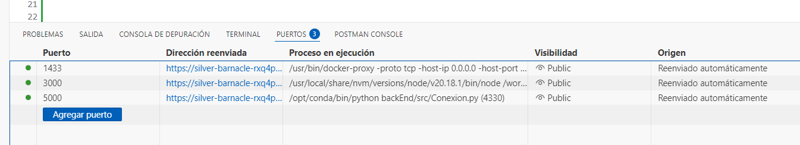

PARA SUBIR LOS CAMBIOS ABRE LA TERMINAL DE GIT Y UTILIZA ESTOS CODIGOS:
git add .
git status
git commit -m "[un numbre para el seguimiento de lo que guardas]"
git push origin main

inicia el proyecto: (bash)
    (en una venta bash)
        docker start e57 && python backEnd/src/Conexion.py 
    (en otra ventana bash)
        npm run start
    (Hacer publicos los puertos)
      ej:  
        
        
        

-----------------------------------iniciar completo ---- usar con conocimiento de bash (Hacer publicos los puertos)
inicia el proyecto:
    docker start e57 > docker.log 2>&1 & python backEnd/src/Conexion.py > python.log 2>&1 & npm run start > npm.log 2>&1

para ver las salidas de cada una de las ejecuciones utiliza el que nececites:
    tail -f npm.log
    tail -f python.log
    tail -f docker.log
    --para ver los logs de la bd en docker (cualquiera de los dos...):
        docker exec -it e57 bash 
        docker logs -f e57

para desocupar los puertos ejecuta:
    kill $(lsof -t -i :5000) $(lsof -t -i :3000)
    -- para docker debes --> docker exec -it e57 bash y ctrl + c

---------------------------test unitarios--------------

back
    pytest backEnd/tests/testpy.py

from 
    npm run test:run

-------------------------test integracion-------------------- 

bash
    chmod +x run_api_tests.sh
    ./run_api_tests.sh
